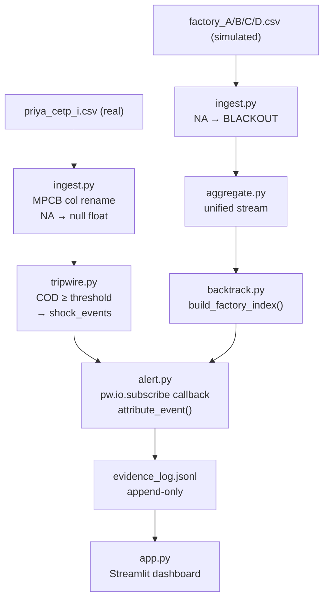
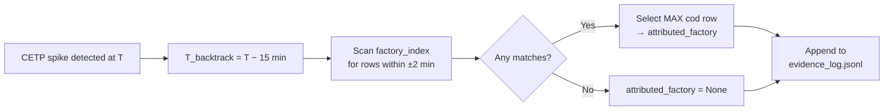
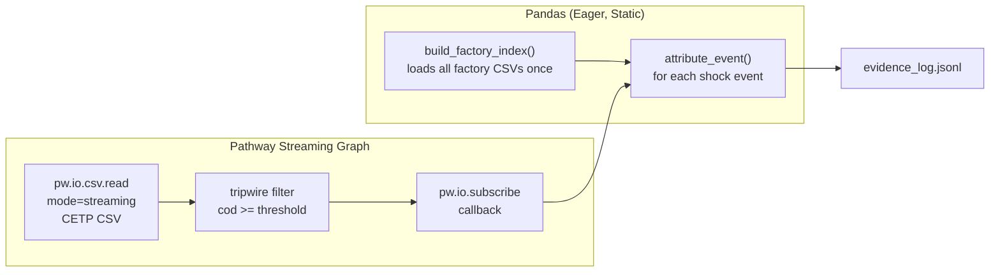

# Architecture

## System Overview

## Data Flow: Attribution

## Streaming Design

## Module Responsibilities

| Module | Role | Key Output |
|---|---|---|
| `simulate_factories.py` | Generate 4 test factory CSVs from CETP timeline | `data/factories/`, `data/cetp/cetp_clean.csv` |
| `ingest.py` | Pathway streaming read, MPCB column rename, NA/BLACKOUT tagging | `pw.Table` (CETP + factory) |
| `aggregate.py` | Convenience wrapper to unify factory stream | `pw.Table` |
| `tripwire.py` | COD threshold filter → shock events | `pw.Table` (shock_events) |
| `backtrack.py` | Pandas factory index + nearest-timestamp attribution | `dict` (evidence record) |
| `alert.py` | `pw.io.subscribe` callback: runs backtrack, writes JSONL, fires webhook | `evidence_log.jsonl` |
| `anti_cheat.py` | Pandas tumbling-window: zero-variance, fingerprint, blackout detection | `tamper_log.jsonl` |
| `api.py` | FastAPI stub of MPCB Open API v2.3 (8 endpoints) | REST API |
| `app.py` | Streamlit dashboard | UI |
| `constants.py` | Single source of truth for all tuneable parameters | — |
